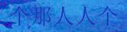

### Chinese text generator as well as crnn based ocr detection system
====================================================================

> # Generate Chinese Word image

- check parameters
```shell
vim conf/generate.yml
```
```yaml
n_bg: 1
n_font: 1
ch_h: 32
n_pic: 20
sample_size: 10
min_len: 4
max_len: 6
bg_dir: data/bgs
font_dir: data/chn_fonts
target_dir: data/ocr_dataset_train_20_10_val
chn_map_path: data/chn_corpus/word_freq.json
```
put your font files eg xyz.ttf to [font dir] attribute
put your background files eg xyz.jpg to [bg dir] attribute

- example generated file


> train with pytorch crnn model

- edit training configuration
```shell
vim conf/train.yml
```

- start the training
```
python train.py
```
- example output
TODO

> infer with trained model

- edit infer configuration
```shell
vim conf/infer.yml
```

- start infering
```
python infer.py
```

- example output
```shell 
DEBUG:root:crnn inited 
CRNN(
  (cnn): Sequential(
    (conv0): Conv2d(3, 64, kernel_size=(3, 3), stride=(1, 1), padding=(1, 1))
    (relu0): ReLU(inplace)
    (pooling0): MaxPool2d(kernel_size=2, stride=2, padding=0, dilation=1, ceil_mode=False)
    (conv1): Conv2d(64, 128, kernel_size=(3, 3), stride=(1, 1), padding=(1, 1))
    (relu1): ReLU(inplace)
    (pooling1): MaxPool2d(kernel_size=2, stride=2, padding=0, dilation=1, ceil_mode=False)
    (conv2): Conv2d(128, 256, kernel_size=(3, 3), stride=(1, 1), padding=(1, 1))
    (batchnorm2): BatchNorm2d(256, eps=1e-05, momentum=0.1, affine=True, track_running_stats=True)
    (relu2): ReLU(inplace)
    (conv3): Conv2d(256, 256, kernel_size=(3, 3), stride=(1, 1), padding=(1, 1))
    (relu3): ReLU(inplace)
    (pooling2): MaxPool2d(kernel_size=(2, 2), stride=(2, 1), padding=(0, 1), dilation=1, ceil_mode=False)
    (conv4): Conv2d(256, 512, kernel_size=(3, 3), stride=(1, 1), padding=(1, 1))
    (batchnorm4): BatchNorm2d(512, eps=1e-05, momentum=0.1, affine=True, track_running_stats=True)
    (relu4): ReLU(inplace)
    (conv5): Conv2d(512, 512, kernel_size=(3, 3), stride=(1, 1), padding=(1, 1))
    (relu5): ReLU(inplace)
    (pooling3): MaxPool2d(kernel_size=(2, 2), stride=(2, 1), padding=(0, 1), dilation=1, ceil_mode=False)
    (conv6): Conv2d(512, 512, kernel_size=(2, 2), stride=(1, 1))
    (batchnorm6): BatchNorm2d(512, eps=1e-05, momentum=0.1, affine=True, track_running_stats=True)
    (relu6): ReLU(inplace)
  )
  (rnn): Sequential(
    (0): BidirectionalLSTM(
      (rnn): LSTM(512, 512, bidirectional=True)
      (embedding): Linear(in_features=1024, out_features=512, bias=True)
    )
    (1): BidirectionalLSTM(
      (rnn): LSTM(512, 512, bidirectional=True)
      (embedding): Linear(in_features=1024, out_features=11, bias=True)
    )
  )
)
INFO:root:img to infer example.jpg
INFO:root:raw output -------的------那那----人人----人人人--------个 real output 的那人人个
```

-actual image

